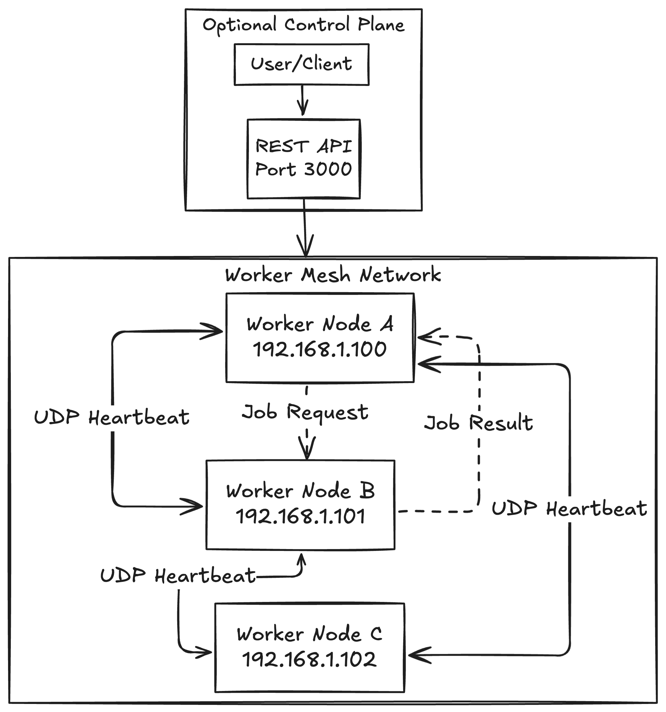

# Worker Mesh - Zero-Config Distributed Task Execution

A decentralized mesh of worker nodes that automatically discover each other and distribute jobs using UDP broadcasts and Protocol Buffers. No central coordinator required.

## Quick Start

```bash

# Clone and setup
git clone https://github.com/yourusername/worker-mesh
cd worker-mesh
make build

# Start 3 nodes in separate terminals
make run-node1  # Terminal 1
make run-node2  # Terminal 2  
make run-node3  # Terminal 3

# Test the mesh
curl -X POST http://localhost:3001/api/v1/jobs \
  -H "Content-Type: application/json" \
  -d '{"command": "echo Hello from the mesh!"}'
```

## What is Worker Mesh?

Worker Mesh is a distributed system where nodes:
- **Auto-discover** each other using UDP broadcasts
- **Execute jobs** submitted via REST API
- **Sync state** using efficient Protocol Buffer messages
- **Operate independently** with no single point of failure

Think Kubernetes workers without the master - pure peer-to-peer job distribution.

## Features

- **🔍 Zero-Config Discovery**: Nodes find each other automatically
- **⚡ Protocol Buffers**: Efficient binary messaging
- **🛡️ Fault Tolerant**: Handles node failures gracefully
- **📊 REST API**: External job submission and monitoring
- **💾 Persistent State**: SQLite for job history and peer tracking
- **⏱️ Job Timeouts**: Automatic cleanup of long-running tasks
- **🔄 Real-time Sync**: Live peer status updates

## 🧠 Architecture


### Core Components

| Component | Purpose |
|-----------|---------|
| **UDP Discovery** | Peer finding via broadcast heartbeats |
| **Job Engine** | Shell command execution with timeouts |
| **SQLite DB** | Local persistence for jobs and peers |
| **Echo API** | REST endpoints for external control |
| **Protobuf Protocol** | Efficient binary messaging |

## Prerequisites

- **Go 1.19+**
- **Protocol Buffers compiler** (`protoc`)

### Install Dependencies

**macOS:**
```bash

brew install protobuf go
```

**Ubuntu/Debian:**
```bash

sudo apt update
sudo apt install protobuf-compiler golang-go
```

**Windows:**
- Download protoc from [releases](https://github.com/protocolbuffers/protobuf/releases)
- Install Go from [golang.org](https://golang.org/dl/)

## Installation

```bash

# Clone repository
git clone https://github.com/yourusername/worker-mesh
cd worker-mesh

# Install Go dependencies
go mod download

# Generate code
make gen

# Build application
make build
```

## Usage

### Starting Nodes

**Single Node:**
```bash

./bin/worker --api-port 3000
```

**Multiple Nodes (for testing):**
```bash

# Terminal 1
make run-node1  # API: :3001, Discovery: :8080

# Terminal 2  
make run-node2  # API: :3002, Discovery: :8080

# Terminal 3
make run-node3  # API: :3003, Discovery: :8080
```

### API Endpoints

| Endpoint | Method | Description |
|----------|--------|-------------|
| `/api/v1/health` | GET | Node health check |
| `/api/v1/status` | GET | Current node status |
| `/api/v1/peers` | GET | Known peer nodes |
| `/api/v1/jobs` | GET | Job execution history |
| `/api/v1/jobs` | POST | Submit new job |

### Submitting Jobs

**Simple Command:**
```bash
curl -X POST http://localhost:3001/api/v1/jobs \
  -H "Content-Type: application/json" \
  -d '{"command": "echo Hello World!"}'
```

**With Environment Variables:**
```bash
curl -X POST http://localhost:3001/api/v1/jobs \
  -H "Content-Type: application/json" \
  -d '{
    "command": "python3 script.py",
    "env": {"PYTHONPATH": "/app", "DEBUG": "1"},
    "timeout_seconds": 300
  }'
```

**Response:**
```json
{
  "job_id": "550e8400-e29b-41d4-a716-446655440000",
  "target_node": "node-abc123",
  "command": "echo Hello World!",
  "status": "JOB_PENDING",
  "created_at": "2025-07-21T10:30:00Z"
}
```

### Checking Results

```bash

# Get job history
curl http://localhost:3001/api/v1/jobs?limit=10

# Check peer discovery
curl http://localhost:3001/api/v1/peers

# Node status
curl http://localhost:3001/api/v1/status
```

### Manual Testing

**1. Verify Discovery:**
```bash

# Start 2 nodes, check if they see each other
curl http://localhost:3001/api/v1/peers
```

**2. Test Job Execution:**
```bash

# Submit job and check results
curl -X POST http://localhost:3001/api/v1/jobs \
  -d '{"command": "uptime"}' \
  -H "Content-Type: application/json"

sleep 2

curl http://localhost:3001/api/v1/jobs?limit=1
```

**3. Test Resilience:**

```bash
# Kill a node (Ctrl+C) and watch others remove it
watch -n 2 "curl -s http://localhost:3001/api/v1/peers"
```

## Protocol Buffers Schema

### NodeInfo (Heartbeat)
```protobuf
message NodeInfo {
  string node_id = 1;           // "node-abc123"
  string address = 2;           // "192.168.1.100:8080"
  NodeStatus status = 3;        // IDLE, BUSY, DRAINING, FAILED
  google.protobuf.Timestamp last_heartbeat = 4;
  map<string, string> metadata = 5;
  string version = 6;
}
```

### Job (Work Distribution)
```protobuf
message Job {
  string job_id = 1;            // UUID
  string target_node_id = 2;    // Which node executes
  string command = 3;           // Shell command
  map<string, string> env = 4;  // Environment variables
  int32 timeout_seconds = 5;    // Max execution time
  JobStatus status = 6;         // PENDING, RUNNING, COMPLETED
  string created_by_node = 7;   // Source node
}
```

### JobResult (Execution Outcome)
```protobuf
message JobResult {
  string job_id = 1;
  string executor_node_id = 2;
  int32 exit_code = 3;          // 0 = success
  string stdout = 4;            // Command output
  string stderr = 5;            // Error output
  google.protobuf.Timestamp started_at = 6;
  google.protobuf.Timestamp finished_at = 7;
}
```

## Configuration

### Command Line Options

```bash

./worker [OPTIONS]

OPTIONS:
  -api-port int    Port for REST API server (default: 3000)
  -help           Show help message

EXAMPLES:
  # Default settings
  ./worker
  
  # Custom API port
  ./worker -api-port 8080
```

### Environment Variables

| Variable | Default | Description |
|----------|---------|-------------|
| `DISCOVERY_PORT` | 8080 | UDP port for peer discovery |
| `HEARTBEAT_INTERVAL` | 5s | How often to broadcast |
| `PEER_TIMEOUT` | 30s | When to remove silent peers |

## Project Structure

```
worker-mesh/
├── proto/              # Protocol Buffer definitions
│   └── mesh.proto
├── internal/
│   ├── discovery/      # UDP peer discovery
│   ├── worker/         # Core node implementation
│   └── jobs/           # Job execution engine
├── ent/                # Database schemas
│   └── schema/
├── api/                # REST API handlers
├── cmd/worker/         # Application entry point
├── bin/                # Built binaries
├── Makefile           # Build commands
└── test-mesh.sh       # Test script
```

## Development

### Available Make Commands

```bash
make build      # Build the application
make run        # Build and run single node
make run-node1  # Run node on port 3001
make run-node2  # Run node on port 3002
make run-node3  # Run node on port 3003
make clean      # Clean build artifacts
make gen        # Generate protobuf + ent code
make test       # Run tests
```

### Adding New Features

1. **Update Protobuf schema** in `proto/mesh.proto`
2. **Regenerate code**: `make proto-gen`
3. **Update database schemas** in `ent/schema/`
4. **Regenerate Ent**: `go generate ./ent`
5. **Implement logic** in `internal/` packages
6. **Add API endpoints** in `api/handlers.go`

## Troubleshooting

### Build Issues

**Protobuf errors:**
```bash

# Install protoc-gen-go plugin
go install google.golang.org/protobuf/cmd/protoc-gen-go@latest

# Add to PATH
export PATH="$PATH:$(go env GOPATH)/bin"
```

**Dependency issues:**
```bash

go mod tidy
go mod download
```

### Runtime Issues

**Nodes not discovering each other:**
- Check UDP port 8080 availability: `netstat -an | grep 8080`
- Verify firewall allows UDP broadcast
- Ensure nodes are on same network segment

**Jobs not executing:**
- Check command syntax (use absolute paths)
- Verify permissions for command execution
- Check timeout settings

**API not responding:**
- Verify port availability: `netstat -an | grep 3001`
- Check node startup logs for errors
- Test health endpoint: `curl http://localhost:3001/api/v1/health`

### Debug Mode

```bash

# Increase log verbosity
RUST_LOG=debug ./worker

# Monitor UDP traffic
sudo tcpdump -i any port 8080

# Watch database changes
sqlite3 worker_*.db "SELECT * FROM jobs ORDER BY created_at DESC LIMIT 5;"
```

## Future Roadmap

### Phase 2: Enhanced Mesh
- [ ] Cross-node job distribution
- [ ] Job result broadcasting
- [ ] Load-based job routing
- [ ] Job dependencies and workflows

### Phase 3: Production Features
- [ ] TLS encryption for security
- [ ] Authentication between nodes
- [ ] Web UI for monitoring
- [ ] Prometheus metrics export

### Phase 4: Scale & Integration
- [ ] Multi-datacenter support
- [ ] Kubernetes operator
- [ ] Docker containerization
- [ ] CI/CD pipeline integration

## Contributing

1. **Fork** the repository
2. **Create** feature branch: `git checkout -b feature/amazing-feature`
3. **Commit** changes: `git commit -m 'Add amazing feature'`
4. **Push** to branch: `git push origin feature/amazing-feature`
5. **Open** Pull Request

### Development Guidelines

- Use `gofmt` for code formatting
- Add tests for new features
- Update documentation
- Follow conventional commit messages

## Acknowledgments

- **Protocol Buffers** for efficient serialization
- **Ent** for type-safe database operations
- **Echo** for the lightweight web framework
- **Go community** for excellent tooling

---

**⚠️ Development Status**: This is an experimental project built for learning distributed systems concepts. While functional, it's not recommended for production use without additional security and reliability improvements.

**🔬 Learning Focus**: This project demonstrates UDP discovery, Protocol Buffers, peer-to-peer communication, and zero-config distributed systems. Perfect for understanding distributed computing fundamentals.
```